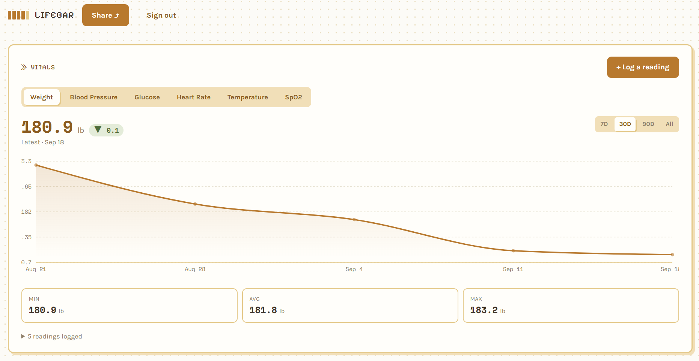
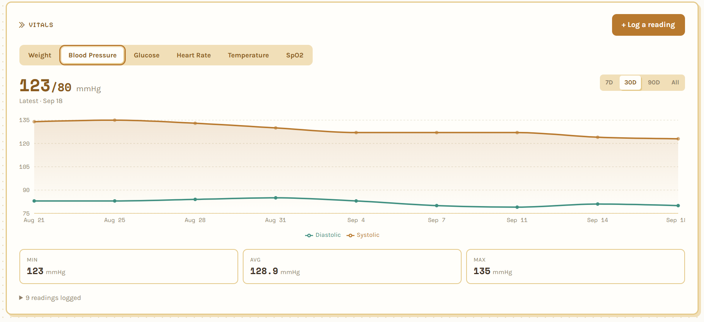
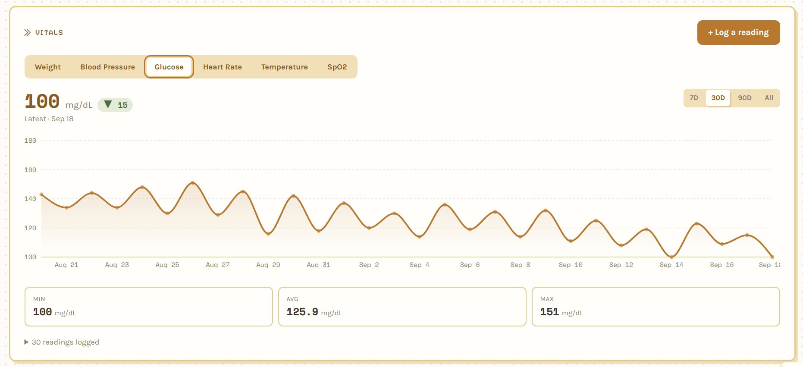
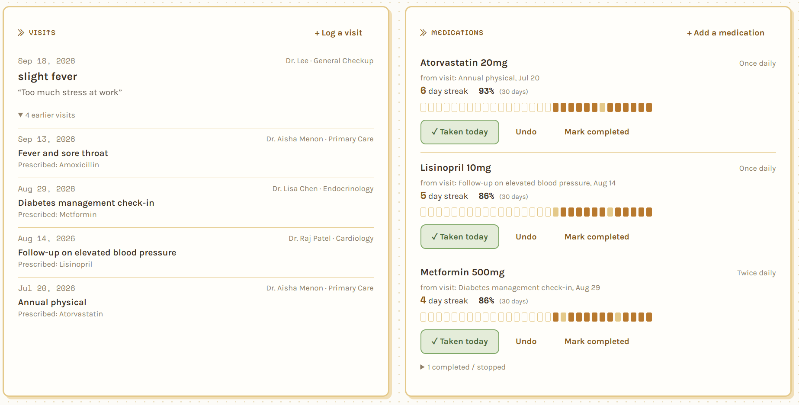
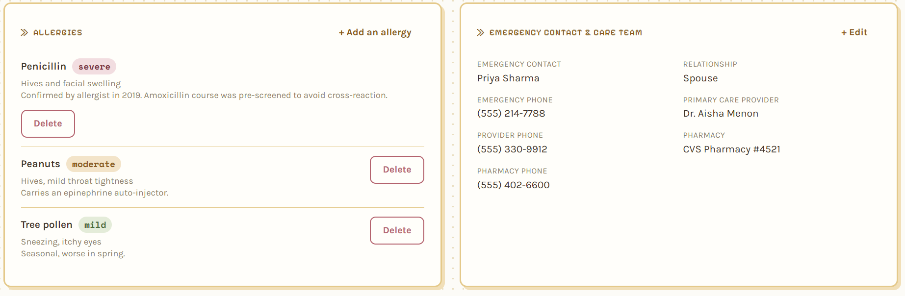
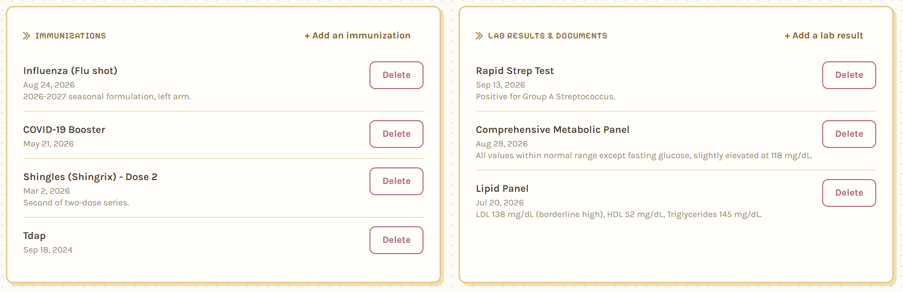
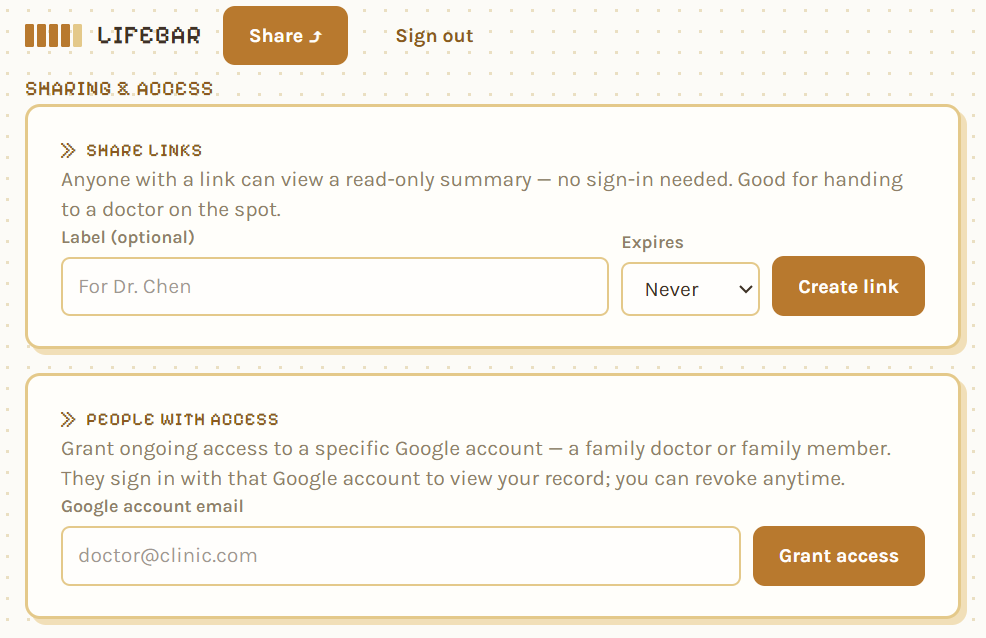

# LifeBar

[](./LICENSE)
[](./CONTRIBUTING.md)
[](https://nextjs.org)
[](https://supabase.com)

**Your medical history belongs to you, not to whichever patient portal your
current doctor happens to use.**

LifeBar is an open source, self-hosted personal health record: visits,
medications with adherence tracking, vitals with real trend charts,
allergies, immunizations, and lab results — all in one place, under your
own account, on your own Supabase project. No app store, no "we sell
anonymized data to third parties," no login you lose access to the day you
switch insurance providers.

It's self-reported by design (see [Philosophy](#philosophy) below), it's a
side project, and it's looking for people who want to keep building it.
**If you've ever wanted a health record that's actually yours, we'd love
your help.**

## Features

### Vitals, charted like they should be



A number scribbled in a notes app doesn't tell you anything. A trend does:
is the blood pressure medication actually working, or was last week's good
reading noise? Weight, blood pressure, glucose, heart rate, temperature,
and SpO2 each get their own interactive chart — 7D/30D/90D/All range,
min/avg/max, full reading history — so the pattern is the thing you see
first, not a table you have to reconstruct in your head.

 

This is for anyone managing something that's measured over time rather
than diagnosed once: hypertension, diabetes, a weight goal, a heart
condition — the people who get told "keep monitoring it and we'll check
again in a month," and are otherwise left to do that in a paper log
nobody, including them, ever looks back at.

### Visits and medications, with real adherence



Every medication remembers which visit prescribed it, so "why am I taking
this" has an answer months later. Adherence is tracked as a streak and a
30-day percentage instead of a vague memory — useful both for you and for
the honest answer to "have you been taking it as prescribed?" at the next
appointment.

Built for anyone on an ongoing prescription, especially more than one —
people managing a chronic condition, older adults juggling several
medications, or a caregiver keeping track on someone else's behalf.

### Allergies and care team, always at hand



This is the information you repeat at every single appointment, and the
information that matters most in a moment when you might not be able to
speak for yourself: allergy severity, an emergency contact, your
pharmacy's phone number. Putting it on one card means it's one card, not a
memory test.

Relevant to everyone, but it matters most for people with a severe
allergy, an ongoing condition, or anyone who wants a new provider — or an
EMT — to be able to see the essentials at a glance via a share link.

### Immunizations and lab results, kept together



Immunization records get lost between pediatrician, school, a move to a
new state, a new employer's requirements. Lab results end up scattered
across whichever patient portal each doctor's office happens to use, none
of which talk to each other. LifeBar just keeps them, in one file, that
outlives any one provider relationship.

Useful for parents tracking a kid's shots, anyone who's changed doctors or
insurance and lost continuity, or anyone trying to build one longitudinal
picture out of labs drawn by different providers over the years.

### Sharing without giving up control



Two different needs, two different mechanisms: a tokenized read-only link
for handing to a doctor's office on the spot — no account required, can
expire — or standing access for a specific Google account, for the person
who should always be able to see updates. Both are revocable anytime, and
neither lets the viewer edit anything.

For anyone with a spouse, adult child, or caregiver who needs ongoing
visibility, and for anyone who's ever sat in an urgent care waiting room
trying to reconstruct a medical history from memory.

### The rest

- **Works before you even sign in** — data lives in `localStorage` until
  you sign in with Google, then migrates automatically into your account.
- **Row Level Security, not application code, is the access boundary** —
  every table is owner-scoped in Postgres itself.

## Stack

- [Next.js](https://nextjs.org) (App Router, React 19)
- [Supabase](https://supabase.com) — Postgres, Auth (Google sign-in), Row
  Level Security for access control
- [Tailwind CSS](https://tailwindcss.com)
- [Radix UI](https://www.radix-ui.com) primitives (Tabs, Dialog) for
  accessible, keyboard-friendly interaction
- [Recharts](https://recharts.org) for the vitals trend charts

## Setup

1. **Create a Supabase project** at [supabase.com](https://supabase.com).
2. **Enable Google sign-in**: Authentication → Providers → Google. Follow
   Supabase's [Google OAuth guide](https://supabase.com/docs/guides/auth/social-login/auth-google)
   to create OAuth credentials, and add your Supabase project's callback URL
   as an authorized redirect URI in the Google Cloud console.
3. **Run the schema**: open the SQL Editor in your Supabase dashboard and run
   `supabase/migrations/0001_init.sql`, then `supabase/migrations/0002_ehr_extensions.sql`.
   Together these create every table, its Row Level Security policies, and
   the functions the sharing features rely on (`has_shared_access`,
   `get_shared_summary`).
4. **Copy the environment file**:
   ```bash
   cp .env.example .env.local
   ```
   Fill in `NEXT_PUBLIC_SUPABASE_URL` and `NEXT_PUBLIC_SUPABASE_ANON_KEY`
   from Project Settings → API.
5. **Install and run**:
   ```bash
   npm install
   npm run dev
   ```
   Open [http://localhost:3000](http://localhost:3000) and sign in with
   Google.

For production, set the same environment variables on your host and add its
URL as an authorized redirect URI for the Google OAuth client.

## How data and sharing work

- Every table (`visits`, `medications`, `medication_logs`, `measurements`,
  `allergies`, `immunizations`, `profile`, `lab_results`) is scoped by Row
  Level Security to `owner_id = auth.uid()` — Postgres enforces this at the
  database layer, not in application code.
- **Share links** (`share_links`) are unauthenticated, tokenized, read-only
  links, optionally expiring, that resolve through the `get_shared_summary`
  Postgres function. Good for handing to a doctor on the spot.
- **Access grants** (`share_grants`) give a specific Google account
  (matched by email) standing read access to your data via a `has_shared_access`
  check inside each table's Row Level Security policy. Good for family or a
  family doctor who should keep seeing updates. Revoke either at any time
  from `/dashboard/sharing`.

## Philosophy

- **Self-reported data is trusted.** There's no validation workflow, no
  clinician sign-off, no gating on what you log about your own body.
  LifeBar is a record you keep, not a chart a system approves.
- **Ownership over convenience.** Self-hosting is more friction than
  signing up for a hosted app. That friction is the point — it's the
  difference between data you control and data a company controls on your
  behalf, until it doesn't.
- **Sharing is read-only.** No one you share with can edit your record —
  only you can.

## Contributing — and where this is going

LifeBar is young and there's a lot of open ground. If any of this sounds
fun, [open an issue or send a PR](./CONTRIBUTING.md) — good first
contributions include:

- **New measurement types** — peak flow, blood ketones, custom
  user-defined vitals with their own charts.
- **Accessibility passes** — the chart components are new; screen reader
  and keyboard coverage could use real testing.
- **Self-hosting docs** — a one-click Vercel/Supabase deploy guide, a
  Docker Compose setup, notes for other Postgres hosts.
- **Data portability** — CSV/JSON export, and import from Apple Health,
  Google Fit, or a CCDA file from a real patient portal.
- **Medication reminders** — a browser or email nudge when a dose is due
  and hasn't been logged.
- **A printable / PDF doctor summary** — the shared read-only view, laid
  out for a clinic room instead of a browser tab.
- **PWA support** — installable, works offline, syncs when back online.
- **i18n** — LifeBar is English-only today.

None of this is a committed roadmap — it's a list of directions that seem
worth exploring. If you want to take one somewhere different, or propose
something not on this list, open an issue first so we can talk shape
before code. See [CONTRIBUTING.md](./CONTRIBUTING.md) for the ground rules
(most importantly: every new health table needs Row Level Security before
it ships).

## License

[AGPL-3.0](./LICENSE). If you run a modified version of LifeBar as a network
service, you must make your modified source available to its users.
